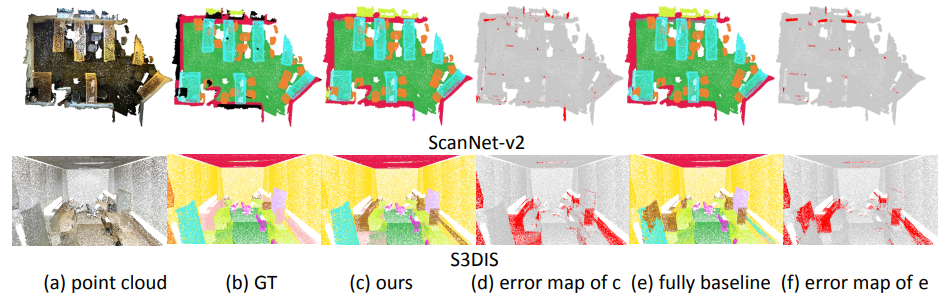

# One Thing One Click
## One Thing One Click: A Self-Training Approach for Weakly Supervised 3D Semantic Segmentation (CVPR2021)
## 

Code for the paper [One Thing One Click: A Self-Training Approach for Weakly Supervised 3D Semantic Segmentation](https://arxiv.org/abs/2104.02246), CVPR 2021, and [One Thing One Click++: Self-Training for Weakly Supervised 3D Scene Understanding](https://arxiv.org/abs/2303.14727). 

**Authors**: Zhengzhe Liu, Xiaojuan Qi, Chi-Wing Fu

 Update on April 16, 2023: One Thing One Click++ is on [Arxiv](https://arxiv.org/abs/2303.14727), codes have been released. 
 Update on Jun 03, 2022: extend One-Thing-One-Click to instance segmentation. Please see the "instance_seg" folder. 
 Update on Jun 03, 2022: a new version on Scannet, achieves comparable performance on "cvpr2021_version". Please see the "scannet" folder. 
 Update on Dec 28, 2021: release the super-voxel generation, code and model on S3DIS. Please see the "s3dis" folder. 
 CVPR 2021 Version: Please see the "cvpr2021_version" folder. 

## Acknowledgement
This repo is built upon several repos, e.g., [PointGrouop](https://github.com/Jia-Research-Lab/PointGroup), [SparseConvNet](https://github.com/facebookresearch/SparseConvNet), [spconv](https://github.com/traveller59/spconv) and [ScanNet](https://github.com/ScanNet/ScanNet). 

## Contact
If you have any questions or suggestions about this repo, please feel free to contact me (liuzhengzhelzz@gmail.com).

