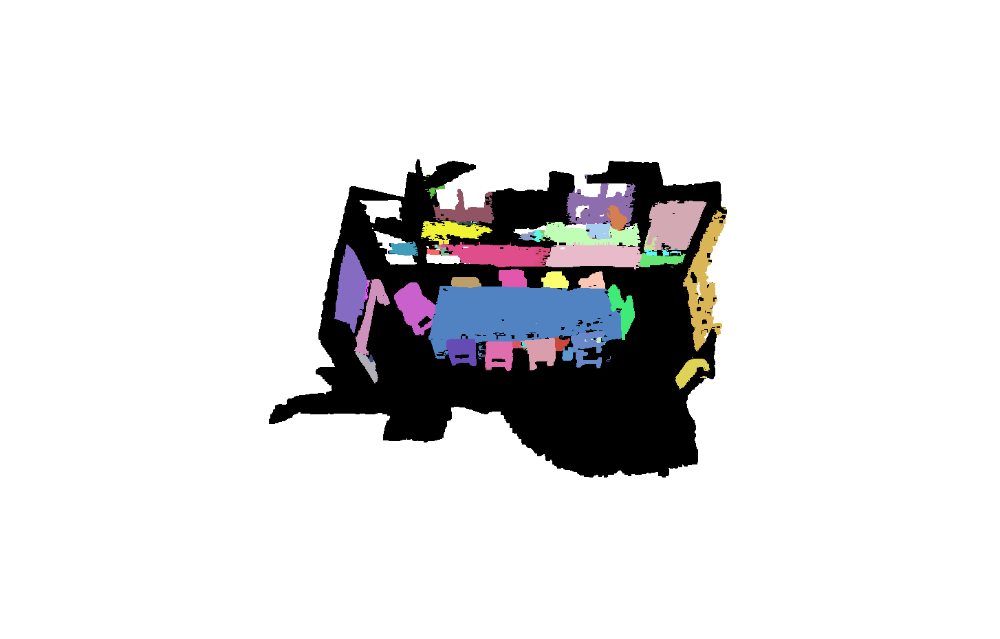

Instance Segmentation Extension for the paper One Thing One Click: A Self-Training Approach for Weakly Supervised 3D Semantic Segmentation.

Authors: Zhengzhe Liu, Xiaojuan Qi, Chi-Wing Fu

## Update on 2022.06.03

* In 3D Instance Segmentation, we achieve 30.2% (AP), 48.5% (AP 50%) and 64.3% (AP 25%) on ScanNet-v2 using "One Thing One Click" with 0.02% annotation. 

* The implementation of Relation-Net is modified. We use a momentum-updated Relation-Net in this version. 

* Efficient super-voxel average pooling using CUDA. 



## Data Preparation

Please follow "Data Preparation" in the "cvpr2021_version" folder. Copy training data (*.pth) into "train_cuda", and copy validation data (*.pth) into "val_cuda"


## Inference and Evaluation

download the weights and features from [here](https://drive.google.com/drive/folders/1LmIAPpk1m0PtVIk8m4EBFHjGzWsPyyAo?usp=sharing)


```
cd instance_seg/
python test.py --config config/pointgroup_run1_scannet.yaml --pretrain pointgroup_run1_scannet-000001778_weight.pth
The results is:
```

```
cabinet        :          0.192          0.401          0.592
bed            :          0.319          0.650          0.770
chair          :          0.613          0.763          0.837
sofa           :          0.439          0.734          0.821
table          :          0.261          0.443          0.596
door           :          0.221          0.397          0.565
window         :          0.106          0.232          0.432
bookshelf      :          0.164          0.411          0.615
picture        :          0.448          0.606          0.671
counter        :          0.004          0.020          0.301
desk           :          0.065          0.219          0.543
curtain        :          0.143          0.271          0.464
refrigerator   :          0.241          0.398          0.415
shower curtain :          0.430          0.619          0.856
toilet         :          0.745          0.918          0.918
sink           :          0.307          0.507          0.788
bathtub        :          0.470          0.754          0.830
otherfurniture :          0.268          0.389          0.555
----------------------------------------------------------------
average        :          0.302          0.485          0.643
```


## Train

We use GPU 0 to train, and GPU 1 for pseudo label updating during training. Please keep GPU 1 free during training. You can choose other GPU to be free in config/pointgroup_run1_scannet.yaml: update_gpu

copy the generated training data to "train_cuda", and use one-thing-one-click semantic segmentation model as an initialization. 

put models from [scannet model](https://drive.google.com/drive/folders/1PZtEsCsEBMAK_ZUXlMl_xTZmOeqc8eER?usp=sharing) to exp/train_cuda/pointgroup/pointgroup_run_init_scannet/

Step 1: Fix the backbone, train the offset weights for around 150 epochs. 
```
python test_fortrain.py --config config/pointgroup_run_init_scannet.yaml --pretrain exp/train_cuda/pointgroup/pointgroup_run1_scannet/pointgroup_run1_scannet-000000976_weight.pth
python train.py --config config/pointgroup_run_init_scannet.yaml
```

put the trained model of step 1 to exp/train_cuda/pointgroup/pointgroup_run1_scannet/

Step 2: Train the whole network using self-training for instance segmentation. 
```
python train.py --config config/pointgroup_run1_scannet.yaml
```


