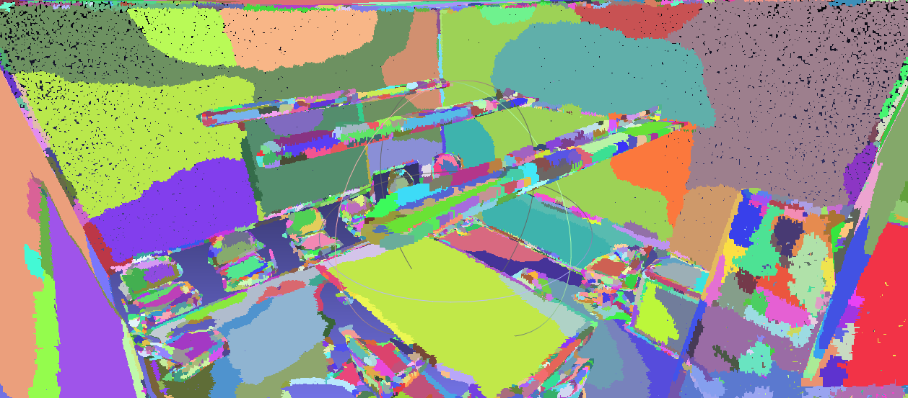

Code for the paper **One Thing One Click: A Self-Training Approach for Weakly Supervised 3D Semantic Segmentation** on S3DIS. 

Authors: Zhengzhe Liu, Xiaojuan Qi, Chi-Wing Fu

## Update on 2021.12.28

* Now we achieve 56.6% mIoU on S3DIS using "One Thing One Click", which is better than the results in the CVPR 2021 paper (50.1%). 

* The implementation of Relation-Net is modified. We use a momentum-updated Relation-Net in this version. 

* Include super-voxel generation code on S3DIS. 

* Efficient super-voxel average pooling using CUDA. 

## Data Preparation

* Download the [S3DIS](http://buildingparser.stanford.edu/dataset.html#Download) dataset "Aligned Version".

* Put the data in the "data/rawdata" folders, and generate the super_voxel. The code is based on [Large-scale Point Cloud Semantic Segmentation with Superpoint Graphs](http://arxiv.org/abs/1711.09869) and [Point Cloud Oversegmentation with Graph-Structured Deep Metric Learning](https://arxiv.org/pdf/1904.02113).

```
cd data
python concate_new.py
python partition.py
python sup_voxel.py
```

* Visualize the generated data in "gt_train" and "gt_val".

```
python vis.py
```

The result should be like 

* Back to s3dis folder
```
cd ..
```

## Inference and Evaluation

download the weights and features from [here](https://drive.google.com/file/d/1L4YM25_BLuPM9mVBqLKh_S0Tj46M4Srp/view?usp=sharing) and [here](https://drive.google.com/file/d/1GC0z2JxGCf5Ih3G-tliGaxUq9N7wLdLF/view?usp=sharing), put "_weight.pth" and "_feat.pth" into "code" folder

'''
cd code
python test.py --config config/pointgroup_run1_scannet.yaml --pretrain pointgroup_run1_scannet-000005104_weight.pth
python evaluate.py --pred result/pred/ --gt ../data/gt/
'''

The results is:
0 ceiling (0.8940590081687007, 14316085, 16012461)
1 floor (0.9456448097808065, 12504841, 13223613)
2 wall (0.6850966170547954, 16628352, 24271543)
3 beam (0.0, 0, 321211)
4 column (0.2179079477467664, 838583, 3848336)
5 window (0.5974193619198259, 1959514, 3279964)
6 door (0.41089054052596324, 1675988, 4078916)
7 chair (0.851795058667336, 1337061, 1569698)
8 table (0.612775711128002, 1964687, 3206209)
9 bookcase (0.6876404086053873, 6546937, 9520873)
10 sofa (0.4531608430832512, 126034, 278122)
11 board (0.5766766627544468, 709013, 1229481)
12 clutter (0.42884354820331394, 5321716, 12409458)
avg iou:  0.5663008090491227


## Train

We use GPU 0 to train, and GPU 1 for pseudo label updating during training. Please keep GPU 1 free during training. You can choose other GPU to be free in config/pointgroup_run1_scannet.yaml line 6: update_gpu

'''
mkdir train_cuda
cp ../data/gt_train/* train_cuda/
python train.py --config config/pointgroup_run1_scannet.yaml
'''